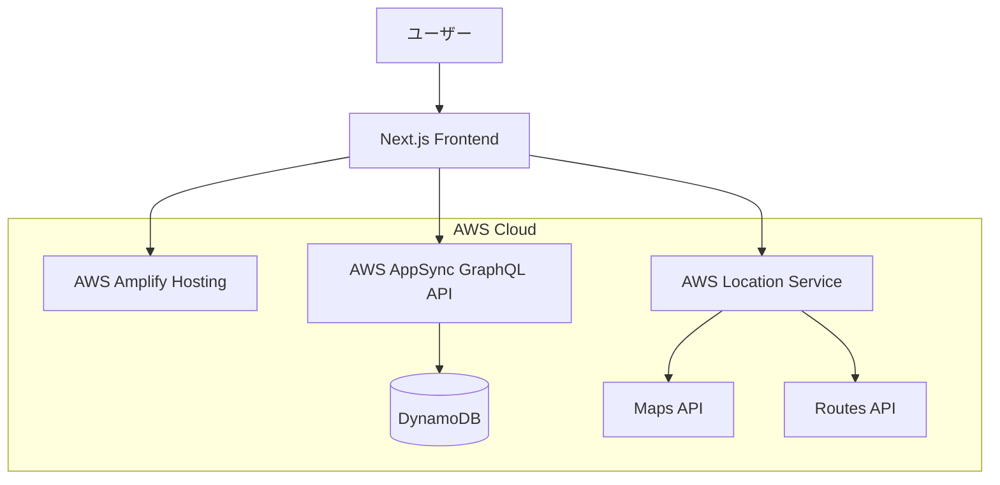

# 設計書

## 概要

ネガティブ道案内アプリは、事故データを活用して安全なルートを提案するジョークアプリです。AWS Location Service、Next.js、AWS Amplify、AppSync, Aurora Serverless v2(Postgres) を組み合わせたサーバーレスアーキテクチャで構築します。

## アーキテクチャ

### システム全体図



### 技術スタック

- **フロントエンド**: Next.js 14 (App Router)
- **マップライブラリ**: MapLibre GL JS
- **ホスティング**: AWS Amplify
- **API**: AWS AppSync (GraphQL)
- **データベース**: Amazon Aurora Serverless v2 (PostgreSQL)
- **マップサービス**: AWS Location Service

- **スタイリング**: Tailwind CSS

## コンポーネントと インターフェース

### フロントエンドコンポーネント

#### 0. MockDataProvider
- **責任**: 開発時のモックデータ提供
- **機能**:
  - 事故データのモック生成
  - ルート計算結果のモック
  - 本番APIとモックAPIの切り替え機能
  - 開発効率向上のためのテストデータ管理

#### 1. MapComponent
- **責任**: AWS Location Serviceを使用したインタラクティブマップの表示
- **機能**:
  - MapLibre GL JSを使用したマップレンダリング
  - 事故データポイントのオーバーレイ表示
  - ユーザーインタラクション（クリック、ズーム、パン）
  - 出発地・目的地マーカーの設定

#### 2. RouteCalculator
- **責任**: ルート計算とルート表示
- **機能**:
  - AWS Location Service Routes APIを使用したルート計算
  - 事故データに基づくルート評価
  - 複数ルートオプションの提示
  - ユーモラスなルート説明の生成

#### 3. AccidentDataOverlay
- **責任**: 事故データの視覚化
- **機能**:
  - 事故発生地点のマーカー表示
  - 重要度別の色分け表示
  - 事故詳細情報のポップアップ

#### 4. NavigationInterface
- **責任**: ユーザーインターフェース
- **機能**:
  - 出発地・目的地入力フォーム
  - ルートオプション選択
  - ジョーク要素を含むメッセージ表示
  - モバイル対応レスポンシブデザイン

### バックエンドコンポーネント

#### 1. GraphQL Schema (AppSync)
```graphql
type Accident {
  id: ID!
  accidentOccurrenceDateAndTime: AWSDateTime
  weatherConditions: String
  accidentLocation: String
  latitude: Float!
  longitude: Float!
  lineOrRoadName: String
  vehicleId: String
  circumstancesCategories1: String
  circumstancesCategories2: String
  circumstancesCategories3: String
  municipalityName: String
  airbagEquippedPartyA: Boolean
  airbagEquippedPartyB: Boolean
  sideAirbagEquippedPartyA: Boolean
  sideAirbagEquippedPartyB: Boolean
  daysSinceCognitiveTestPartyA: Int
  daysSinceCognitiveTestPartyB: Int
  drivingPracticeMethodPartyA: String
  drivingPracticeMethodPartyB: String
  geometry: String
  severity: AccidentSeverity!
  createdAt: AWSDateTime!
}

type Route {
  id: ID!
  startLat: Float!
  startLng: Float!
  endLat: Float!
  endLng: Float!
  distance: Float!
  duration: Int!
  accidentCount: Int!
  safetyScore: Float!
  humorousDescription: String!
  geometry: String!
  # AWS Location Serviceから取得したルート情報
  awsRouteData: String # JSON文字列として保存
}

type Query {
  listAccidents(limit: Int, nextToken: String): AccidentConnection
  getAccidentsByRegion(
    northEast: CoordinateInput!
    southWest: CoordinateInput!
  ): [Accident!]!
  calculateSafeRoute(
    origin: CoordinateInput!
    destination: CoordinateInput!
  ): [Route!]!
}

input CoordinateInput {
  latitude: Float!
  longitude: Float!
}

type AccidentConnection {
  items: [Accident!]!
  nextToken: String
}
```

#### 2. Aurora Serverless v2 (PostgreSQL) データベース設計

**accidents テーブル**
```sql
CREATE TABLE accidents (
  id UUID PRIMARY KEY DEFAULT gen_random_uuid(),
  accident_occurrence_date_and_time TIMESTAMP,
  weather_conditions VARCHAR(100),
  accident_location TEXT,
  latitude DECIMAL(10, 8) NOT NULL,
  longitude DECIMAL(11, 8) NOT NULL,
  line_or_road_name VARCHAR(200),
  vehicle_id VARCHAR(50),
  circumstances_categories_1 VARCHAR(100),
  circumstances_categories_2 VARCHAR(100),
  circumstances_categories_3 VARCHAR(100),
  municipality_name VARCHAR(100),
  airbag_equipped_party_a BOOLEAN,
  airbag_equipped_party_b BOOLEAN,
  side_airbag_equipped_party_a BOOLEAN,
  side_airbag_equipped_party_b BOOLEAN,
  days_since_cognitive_test_party_a INTEGER,
  days_since_cognitive_test_party_b INTEGER,
  driving_practice_method_party_a VARCHAR(100),
  driving_practice_method_party_b VARCHAR(100),
  geometry TEXT,
  -- アプリ用の追加フィールド
  severity VARCHAR(20) GENERATED ALWAYS AS (
    CASE 
      WHEN circumstances_categories_1 ILIKE '%死亡%' OR circumstances_categories_1 ILIKE '%重傷%' THEN 'CRITICAL'
      WHEN circumstances_categories_1 ILIKE '%軽傷%' THEN 'HIGH'
      WHEN circumstances_categories_1 ILIKE '%物損%' THEN 'MEDIUM'
      ELSE 'LOW'
    END
  ) STORED,
  created_at TIMESTAMP DEFAULT CURRENT_TIMESTAMP
);

-- 地理的検索用のインデックス
CREATE INDEX idx_accidents_location ON accidents USING GIST (
  point(longitude, latitude)
);

-- 重要度別検索用のインデックス
CREATE INDEX idx_accidents_severity ON accidents (severity);

-- 日時検索用のインデックス
CREATE INDEX idx_accidents_date ON accidents (accident_occurrence_date_and_time);

-- 地域検索用のインデックス
CREATE INDEX idx_accidents_municipality ON accidents (municipality_name);
```

## データモデル

### 事故データモデル
```typescript
interface Accident {
  id: string;
  accidentOccurrenceDateAndTime?: string;
  weatherConditions?: string;
  accidentLocation?: string;
  latitude: number;
  longitude: number;
  lineOrRoadName?: string;
  vehicleId?: string;
  circumstancesCategories1?: string;
  circumstancesCategories2?: string;
  circumstancesCategories3?: string;
  municipalityName?: string;
  airbagEquippedPartyA?: boolean;
  airbagEquippedPartyB?: boolean;
  sideAirbagEquippedPartyA?: boolean;
  sideAirbagEquippedPartyB?: boolean;
  daysSinceCognitiveTestPartyA?: number;
  daysSinceCognitiveTestPartyB?: number;
  drivingPracticeMethodPartyA?: string;
  drivingPracticeMethodPartyB?: string;
  geometry?: string;
  severity: 'LOW' | 'MEDIUM' | 'HIGH' | 'CRITICAL';
  createdAt: string;
}
```

### ルートデータモデル
```typescript
interface Route {
  id: string;
  startLat: number;
  startLng: number;
  endLat: number;
  endLng: number;
  distance: number; // メートル
  duration: number; // 秒
  accidentCount: number;
  safetyScore: number; // 0-100のスコア
  humorousDescription: string;
  geometry: string; // GeoJSON LineString
  awsRouteData?: string; // AWS Location Serviceからの生データ（JSON）
}

// AWS Location Serviceのルートレスポンス用
interface AWSRouteResponse {
  routes: Array<{
    legs: Array<{
      startPosition: [number, number];
      endPosition: [number, number];
      distance: number;
      durationSeconds: number;
      geometry: {
        lineString: number[][];
      };
    }>;
    summary: {
      routeBBox: number[];
      distance: number;
      durationSeconds: number;
    };
  }>;
}
```

### 座標データモデル
```typescript
interface Coordinate {
  latitude: number;
  longitude: number;
}
```

## エラーハンドリング

### フロントエンド エラーハンドリング
1. **マップ読み込みエラー**
   - フォールバック: 静的マップまたはエラーメッセージ
   - ユーザー通知: 「マップが読み込めませんでした。しばらくしてから再試行してください。」

2. **ルート計算エラー**
   - フォールバック: 直線距離での概算表示
   - ユーモラスメッセージ: 「ルートが見つかりません。徒歩で行くしかないようです！」

3. **事故データ取得エラー**
   - フォールバック: キャッシュされたデータまたは空の状態
   - ユーザー通知: 「事故データを取得できませんでした。今日は運が良いかもしれません！」

### バックエンド エラーハンドリング
1. **Aurora Serverless v2接続エラー**
   - ログ記録とアラート
   - GraphQLエラーレスポンス
   - 接続プール管理

2. **AWS Location Service APIエラー**
   - リトライ機構
   - フォールバック処理

### 開発環境
- **ローカル開発**: Next.js dev server + モックデータ対応
- **モックデータ**: バックエンド開発と並行してフロントエンド開発を進めるためのモックAPI
- **ステージング**: AWS Amplify branch deployment

### 本番環境
- **AWS Amplify**: 自動ビルド・デプロイ
- **CDN**: CloudFront経由での配信
- **モニタリング**: CloudWatch + AWS X-Ray

### CI/CD パイプライン
1. **コードプッシュ** → GitHub
2. **自動ビルド** → AWS Amplify
3. **テスト実行** → Jest + Playwright
4. **デプロイ** → 本番環境

## パフォーマンス最適化

### フロントエンド最適化
- **マップタイル キャッシュ**: ブラウザキャッシュ + Service Worker
- **事故データ 遅延読み込み**: 表示領域に応じた動的データ取得
- **ルート計算 デバウンス**: ユーザー入力の最適化

### バックエンド最適化
- **Aurora Serverless v2**: 適切なインデックス設計と接続プール
- **AppSync**: DataLoaderパターンでN+1問題回避
- **AWS Location Service**: リクエスト最適化とキャッシュ

## 国際化・ローカライゼーション

### 多言語対応
- **日本語**: メインターゲット
- **英語**: 国際対応（オプション）

### 地域対応
- **日本の道路事情**: 左側通行対応
- **日本の地図データ**: AWS Location Serviceの日本地図使用