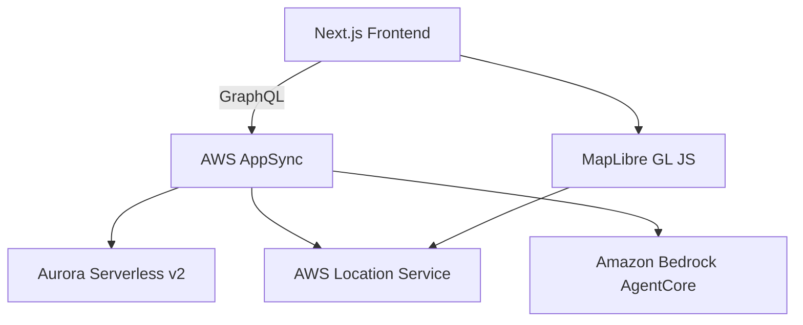

# ネガティブ道案内アプリ 要件定義書

## プロジェクト概要

### アプリケーション名
**"WorstRoute"** - ネガティブな道案内アプリ

### コンセプト
二点間の経路を表示するが、経路上で発生した事故を可視化し、旅程で起きる最悪のシナリオを予測・提示するユニークな道案内アプリケーション。従来のナビアプリが「最適ルート」を提案するのに対し、本アプリは「起こりうる最悪の状況」を事前に知らせることで、ユーザーの心の準備と代替プラン検討を支援する。

---

## 機能要件

### 1. コア機能

#### 1.1 ルート検索・表示機能
- **基本ルート計算**: MapLibre + AWS Location Service による二点間の経路算出
- **複数ルート提案**: 最大3つの異なるルートを提案
- **インタラクティブ地図**: 地図上でのルート表示、ズーム、パン操作

#### 1.2 事故データ可視化機能
- **事故発生地点の表示**: 地図上にアイコンで事故地点をマーキング
- **事故詳細情報**: 事故種別、発生日時、被害規模、影響範囲
- **ルート上事故の強調表示**: 選択したルート上の事故を特別にハイライト
- **事故密度ヒートマップ**: エリア別の事故発生頻度を色分け表示

#### 1.3 最悪シナリオ予測機能
- **Amazon Bedrock AgentCore活用**: AIによる最悪シナリオの生成
- **リスクスコア算出**: ルート毎のリスクレベルを数値化
- **予想される問題**: 渋滞、事故リスク、天候影響、工事情報
- **代替案の提案**: リスクを回避するための代替ルート提案

### 2. データ管理機能

#### 2.1 事故データ管理
- **事故情報の登録**: 新規事故情報の追加
- **事故情報の更新**: 既存事故の状況変更
- **事故情報の削除**: 古い事故データのアーカイブ
- **事故カテゴリ分類**: 交通事故、自然災害、工事、その他

#### 2.2 ユーザーデータ管理
- **検索履歴**: 過去の検索ルートの保存
- **お気に入りルート**: よく使うルートのブックマーク
- **設定管理**: ユーザーの表示設定、通知設定

### 3. 分析・レポート機能

#### 3.1 統計情報表示
- **エリア別事故統計**: 地域毎の事故発生傾向
- **時間別リスク分析**: 時間帯別のリスクレベル
- **季節性分析**: 季節・天候による事故傾向

#### 3.2 予測レポート生成
- **旅程リスクレポート**: 選択したルートの詳細リスク分析
- **最悪ケースシナリオ**: AI生成による具体的な最悪事態の説明
- **対策提案**: リスク軽減のための具体的アドバイス

---

## 技術要件

### 1. アーキテクチャ

#### 1.1 フロントエンド
- **フレームワーク**: Next.js 14+ (App Router)
- **デプロイ**: AWS Amplify
- **言語**: TypeScript
- **スタイリング**: Tailwind CSS
- **地図ライブラリ**: MapLibre GL JS
- **状態管理**: Zustand または React Context

#### 1.2 バックエンド
- **API**: AWS AppSync (GraphQL)
- **データベース**: Amazon Aurora Serverless v2 (PostgreSQL)
- **認証**: Amazon Cognito
- **AI/ML**: Amazon Bedrock AgentCore
- **位置情報**: AWS Location Service

#### 1.3 システム連携


### 2. データベース設計

#### 2.1 主要テーブル

```sql
-- 事故情報テーブル
CREATE TABLE accidents (
    id UUID PRIMARY KEY DEFAULT gen_random_uuid(),
    latitude DECIMAL(10, 8) NOT NULL,
    longitude DECIMAL(11, 8) NOT NULL,
    accident_type VARCHAR(50) NOT NULL,
    severity_level INTEGER CHECK (severity_level BETWEEN 1 AND 5),
    description TEXT,
    occurred_at TIMESTAMP WITH TIME ZONE NOT NULL,
    resolved_at TIMESTAMP WITH TIME ZONE,
    created_at TIMESTAMP WITH TIME ZONE DEFAULT NOW(),
    updated_at TIMESTAMP WITH TIME ZONE DEFAULT NOW()
);

-- ルート情報テーブル
CREATE TABLE routes (
    id UUID PRIMARY KEY DEFAULT gen_random_uuid(),
    user_id UUID,
    start_latitude DECIMAL(10, 8) NOT NULL,
    start_longitude DECIMAL(11, 8) NOT NULL,
    end_latitude DECIMAL(10, 8) NOT NULL,
    end_longitude DECIMAL(11, 8) NOT NULL,
    route_geometry JSONB NOT NULL,
    risk_score DECIMAL(3, 2),
    created_at TIMESTAMP WITH TIME ZONE DEFAULT NOW()
);

-- シナリオ予測テーブル
CREATE TABLE scenarios (
    id UUID PRIMARY KEY DEFAULT gen_random_uuid(),
    route_id UUID REFERENCES routes(id),
    scenario_type VARCHAR(50) NOT NULL,
    probability DECIMAL(3, 2),
    description TEXT NOT NULL,
    mitigation_advice TEXT,
    created_at TIMESTAMP WITH TIME ZONE DEFAULT NOW()
);

-- ユーザー設定テーブル
CREATE TABLE user_preferences (
    id UUID PRIMARY KEY DEFAULT gen_random_uuid(),
    user_id UUID UNIQUE NOT NULL,
    risk_tolerance INTEGER CHECK (risk_tolerance BETWEEN 1 AND 5),
    notification_enabled BOOLEAN DEFAULT TRUE,
    preferred_map_style VARCHAR(50) DEFAULT 'standard',
    created_at TIMESTAMP WITH TIME ZONE DEFAULT NOW(),
    updated_at TIMESTAMP WITH TIME ZONE DEFAULT NOW()
);
```

### 3. API設計

#### 3.1 GraphQL Schema

```graphql
type Accident {
  id: ID!
  latitude: Float!
  longitude: Float!
  accidentType: AccidentType!
  severityLevel: Int!
  description: String
  occurredAt: AWSDateTime!
  resolvedAt: AWSDateTime
  createdAt: AWSDateTime!
  updatedAt: AWSDateTime!
}

type Route {
  id: ID!
  userId: ID
  startLatitude: Float!
  startLongitude: Float!
  endLatitude: Float!
  endLongitude: Float!
  routeGeometry: AWSJSON!
  riskScore: Float
  accidents: [Accident!]!
  scenarios: [Scenario!]!
  createdAt: AWSDateTime!
}

type Scenario {
  id: ID!
  routeId: ID!
  scenarioType: ScenarioType!
  probability: Float!
  description: String!
  mitigationAdvice: String
  createdAt: AWSDateTime!
}

enum AccidentType {
  TRAFFIC_ACCIDENT
  NATURAL_DISASTER
  CONSTRUCTION
  ROAD_CLOSURE
  OTHER
}

enum ScenarioType {
  TRAFFIC_JAM
  ACCIDENT_RISK
  WEATHER_IMPACT
  CONSTRUCTION_DELAY
  ROUTE_UNAVAILABLE
}

type Query {
  getRoute(id: ID!): Route
  searchRoutes(startLat: Float!, startLng: Float!, endLat: Float!, endLng: Float!): [Route!]!
  getAccidentsInArea(bounds: BoundingBoxInput!): [Accident!]!
  getUserPreferences(userId: ID!): UserPreferences
}

type Mutation {
  calculateWorstCaseRoute(input: RouteInput!): Route!
  reportAccident(input: AccidentInput!): Accident!
  updateUserPreferences(input: UserPreferencesInput!): UserPreferences!
}

type Subscription {
  onAccidentReported(bounds: BoundingBoxInput!): Accident
  onRouteUpdated(routeId: ID!): Route
}
```

---

## 非機能要件

### 1. パフォーマンス要件
- **地図読み込み時間**: 3秒以内
- **ルート計算時間**: 5秒以内
- **同時ユーザー数**: 1,000人
- **API応答時間**: 500ms以内（95%ile）

### 2. セキュリティ要件
- **認証**: Amazon Cognitoによる多要素認証対応
- **認可**: GraphQLレベルでの細かい権限制御
- **データ暗号化**: 保存時・転送時の暗号化
- **個人情報保護**: GDPR準拠、位置情報の適切な匿名化

### 3. 可用性要件
- **稼働率**: 99.9%
- **災害対策**: マルチAZ構成
- **バックアップ**: 日次自動バックアップ、ポイントインタイム復旧対応

### 4. スケーラビリティ要件
- **データベース**: Aurora Serverless v2による自動スケーリング
- **フロントエンド**: Amplifyによる自動スケーリング
- **API**: AppSyncによる自動スケーリング

---

## ユーザーストーリー

### 1. 基本的な利用フロー

#### ストーリー1: 初回ユーザーがルート検索
```
As a 新規ユーザー
I want to 出発地と目的地を設定してルートを検索したい
So that 旅程で起こりうる最悪の状況を事前に把握できる
```

**受け入れ基準:**
- 住所または地図上のクリックで出発地・目的地を設定できる
- 複数のルート候補が表示される
- 各ルートのリスクスコアが表示される
- 事故発生地点が地図上にマーカーで表示される

#### ストーリー2: 最悪シナリオの確認
```
As a ユーザー
I want to 選択したルートで起こりうる最悪のシナリオを知りたい
So that 適切な準備や代替プランを立てることができる
```

**受け入れ基準:**
- AIが生成した最悪ケースシナリオが文章で表示される
- シナリオの発生確率が数値で示される
- 対策・軽減策のアドバイスが表示される
- より安全な代替ルートが提案される

#### ストーリー3: 事故情報の報告
```
As a ユーザー
I want to 新たに発見した事故や道路状況を報告したい
So that 他のユーザーが同じリスクを回避できる
```

**受け入れ基準:**
- 地図上で事故発生地点をタップして報告できる
- 事故の種類、規模、詳細を入力できる
- 報告した事故が即座に地図上に反映される
- 報告者に確認通知が送信される

### 2. 上級者向け機能

#### ストーリー4: カスタムリスク設定
```
As a 経験豊富なユーザー
I want to 自分のリスク許容度に応じて表示をカスタマイズしたい
So that より自分に適した情報を得ることができる
```

#### ストーリー5: 統計分析の閲覧
```
As a データに関心があるユーザー
I want to エリア別・時間別の事故統計を閲覧したい
So that より深い洞察を得て、旅行計画を最適化できる
```

---

## 開発計画

### フェーズ1: MVP（4週間）
- [ ] Next.js + MapLibre基盤構築
- [ ] AWS Location Serviceの基本ルート検索
- [ ] 基本的な事故データ表示
- [ ] シンプルなUIデザイン

### フェーズ2: コア機能（6週間）
- [ ] Aurora Serverless v2 + AppSync GraphQL API
- [ ] Amazon Bedrock AgentCoreによるシナリオ生成
- [ ] 複数ルート比較機能
- [ ] リスクスコア算出

### フェーズ3: 高度な機能（4週間）
- [ ] ユーザー認証・設定機能
- [ ] 事故報告・管理機能
- [ ] 統計・分析ダッシュボード
- [ ] パフォーマンス最適化

### フェーズ4: 本格運用（2週間）
- [ ] セキュリティ監査
- [ ] パフォーマンステスト
- [ ] ユーザビリティテスト
- [ ] 本番リリース

---

## 成功指標（KPI）

### 1. 利用指標
- **月間アクティブユーザー**: 1,000人
- **ルート検索回数**: 10,000回/月
- **事故報告数**: 100件/月

### 2. エンゲージメント指標
- **セッション時間**: 平均5分
- **リピート率**: 30%
- **ユーザー満足度**: 4.0/5.0

### 3. 技術指標
- **API成功率**: 99.9%
- **平均応答時間**: 500ms以下
- **エラー率**: 1%以下

---

## リスク・制約事項

### 1. 技術リスク
- **データ品質**: 事故データの正確性・即時性の確保
- **AI精度**: Bedrockによるシナリオ予測の妥当性
- **スケーラビリティ**: 大量データ処理時のパフォーマンス

### 2. ビジネスリスク
- **ユーザー受容性**: ネガティブな情報への心理的抵抗
- **法的責任**: 予測情報による実害発生時の責任範囲
- **データプライバシー**: 位置情報の取り扱いに関する規制

### 3. 運用リスク
- **データメンテナンス**: 継続的な事故データの更新・管理
- **コスト管理**: AWS利用料金の予想外の増加
- **サポート体制**: ユーザーサポートの品質確保

---

## 結論

本アプリケーションは、従来のナビゲーションアプリとは一線を画すユニークなアプローチにより、ユーザーの安全意識向上と適切な旅行計画策定を支援する。AWS の最新技術スタックを活用することで、スケーラブルで信頼性の高いシステム構築が可能である。

成功のカギは、**正確なデータ収集**、**AIによる適切な予測**、**直感的なUI/UX**の3点にあり、段階的な開発アプローチによってリスクを最小化しながら価値ある製品を提供できる。